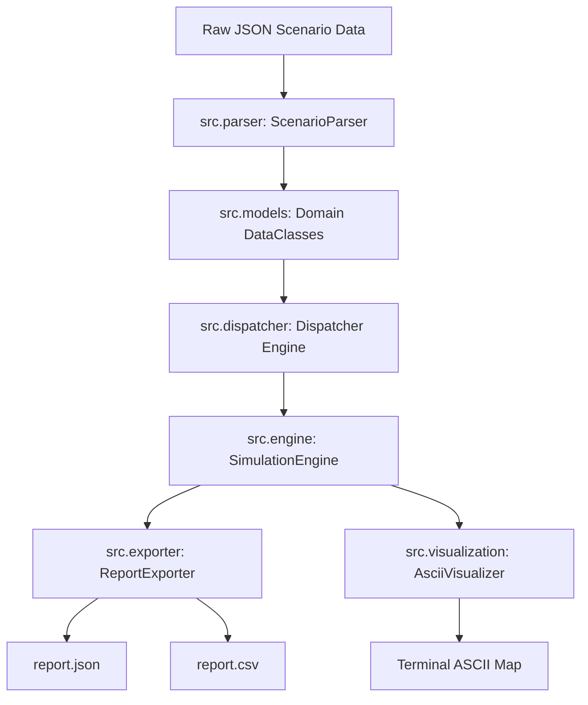

# FastBox Mystery Delivery System — Enterprise Logistics Simulator

[](https://www.python.org/downloads/)
[]()
[]()
[]()

> **An autonomous, production-grade 2D logistics simulation and dispatch platform designed for FastBox Operations.**

---

## 📑 Table of Contents

1. [Executive Summary (For Non-Technical & New Readers)](#1-executive-summary)
2. [Problem Statement & Operational Physics](#2-problem-statement--operational-physics)
3. [System Architecture & Design Principles](#3-system-architecture--design-principles)
4. [Project Directory & File Structure](#4-project-directory--file-structure)
5. [Step-by-Step Algorithm & Mathematical Formulation](#5-step-by-step-algorithm--mathematical-formulation)
   - [5.1 Multi-Schema Data Normalization](#51-multi-schema-data-normalization)
   - [5.2 Distance Metric: 2D Euclidean Geometry](#52-distance-metric-2d-euclidean-geometry)
   - [5.3 Nearest-Agent Dispatch Algorithm](#53-nearest-agent-dispatch-algorithm)
   - [5.4 Multi-Hop Route Simulation Mechanics](#54-multi-hop-route-simulation-mechanics)
   - [5.5 Efficiency & Best Agent Formulation](#55-efficiency--best-agent-formulation)
6. [Bonus Features Deep Dive](#6-bonus-features-deep-dive)
   - [6.1 ASCII Route & Terminal Grid Visualizer](#61-ascii-route--terminal-grid-visualizer)
   - [6.2 CSV Report & Top Performer Exporter](#62-csv-report--top-performer-exporter)
   - [6.3 Stochastic Operational Delays](#63-stochastic-operational-delays)
   - [6.4 Dynamic Mid-Day Agent Joining & Rebalancing](#64-dynamic-mid-day-agent-joining--rebalancing)
7. [Installation & Setup](#7-installation--setup)
8. [CLI Usage Guide](#8-cli-usage-guide)
9. [Automated Test Suite & Verification Results](#9-automated-test-suite--verification-results)
10. [Example JSON & CSV Outputs](#10-example-json--csv-outputs)
11. [Design Considerations & Edge Cases Handled](#11-design-considerations--edge-cases-handled)

---

## 1. Executive Summary

### What is this project?
FastBox is a parcel delivery company operating across a regional territory. Packages arrive at various storage **warehouses** throughout the day. A fleet of delivery **agents** (drivers) starts at specific base coordinates. Each package must be picked up from its origin warehouse and transported directly to its customer **destination**.

### What problem does this simulator solve?
In real-world logistics, inefficient dispatching leads to wasted fuel, longer delivery times, and driver fatigue. This simulator solves three core challenges:
1. **Intelligent Dispatch**: Automatically determines which agent should pick up which package based on geographic proximity.
2. **Realistic Route Tracking**: Simulates the movement of each agent step-by-step from their starting spot $\to$ pickup warehouse $\to$ drop-off destination $\to$ subsequent pickups.
3. **Performance Benchmarking**: Calculates precise metrics (total kilometers traveled, number of deliveries, distance-per-package efficiency) to identify the **top-performing agent** of the day.

---

## 2. Problem Statement & Operational Physics

The simulation takes place on a continuous 2D Cartesian coordinate plane where each point is defined by $(x, y)$.

```
   Y (Latitude/Grid Units)
   ▲
90 ┼ . . . . . . . . . . . . . [D: Customer Destination (70, 90)]
   │                            ▲
75 ┼ . . . . . . [W: Warehouse (50, 75)] ───► Delivery Leg 2
   │              ▲
60 ┼ . . . . . . [A: Agent Start (60, 60)] ───► Pickup Leg 1
   │
 0 ┼────────────────────────────────────────────────────────► X (Longitude/Grid Units)
   0             50              70
```

### Core Entities:
- **Warehouses ($W_i$)**: Fixed supply depots with coordinates $(x_w, y_w)$.
- **Agents ($A_j$)**: Delivery drivers starting at $(x_{a0}, y_{a0})$ and continuously updating their location $(x_{at}, y_{at})$ as they fulfill orders.
- **Packages ($P_k$)**: Parcels situated at a designated warehouse $W_i$ with target delivery destination $(x_d, y_d)$.

---

## 3. System Architecture & Design Principles

The codebase follows **Clean Architecture**, **Domain-Driven Design (DDD)**, and **SOLID** engineering principles:



### Architectural Highlights:
1. **Single Responsibility Principle (SRP)**: Parsing, mathematical distance calculations, dispatching algorithms, route physics, ASCII rendering, and file exporting are strictly isolated into distinct modules.
2. **Immutability & Type Safety**: Strongly typed domain models (`Point`, `Warehouse`, `Agent`, `Package`, `AgentReport`, `SimulationReport`) built with Python `@dataclass`.
3. **Multi-Schema Resiliency**: Automatically handles both object-map schemas and list-of-dicts schemas without requiring changes from the user.
4. **Zero External Dependencies**: Pure Python 3 standard library implementation (`math`, `json`, `csv`, `dataclasses`, `argparse`, `random`, `glob`, `os`).

---

## 4. Project Directory & File Structure

```text
Python Assignment -2026/
├── src/                                            # Core Modular Architecture Package
│   ├── __init__.py                                 # Package namespace exposure
│   ├── models.py                                   # Domain dataclasses (Point, Agent, Package, etc.)
│   ├── distance.py                                 # Euclidean metric calculations
│   ├── parser.py                                   # Schema-agnostic JSON loader and normalizer
│   ├── dispatcher.py                               # Nearest-agent dispatch strategy
│   ├── engine.py                                   # Operational physics & route execution engine
│   ├── visualization.py                           # 2D ASCII terminal map renderer
│   └── exporter.py                                # JSON & CSV serialization engine
│
├── Python Assignment(Delivery System Test Cases)/  # Official test scenarios
│   ├── test_case_1.json                            # 12 packages, 4 agents, 5 warehouses
│   ├── ...                                         # (Full test suite 1 through 10)
│   └── test_case_10.json                           # 11 packages, 4 agents, 4 warehouses
│
├── Python Assignment(Delivery System).pdf          # Official assignment specification
├── base_case.json                                  # Base scenario dataset
├── main.py                                         # Primary modern CLI entry point
├── delivery_simulator.py                           # Standalone & backward-compatible runner
├── test_runner.py                                  # Automated batch validation test suite
├── requirements.txt                                # Project & development dependencies
├── .gitignore                                      # Standard git ignore rules
├── report.json                                     # Generated JSON output report
├── report.csv                                      # (Bonus) Generated CSV metrics export
├── STAKEHOLDER_DOCUMENTATION.md                    # Executive presentation & whitepaper
└── README.md                                       # Complete project documentation
```

### 📋 Detailed Inventory of Generated Project Files

| File / Component | Type | Responsibility & Purpose |
| :--- | :--- | :--- |
| **[`src/models.py`](file:///c:/Users/lenovo/Downloads/Python%20Assignment%20-2026/src/models.py)** | Core Domain | Strongly-typed immutable dataclasses (`Point`, `Warehouse`, `Agent`, `Package`, `AgentReport`, `SimulationReport`). |
| **[`src/distance.py`](file:///c:/Users/lenovo/Downloads/Python%20Assignment%20-2026/src/distance.py)** | Math Engine | 2D Euclidean distance calculation ($\sqrt{\Delta x^2 + \Delta y^2}$) using `math.hypot`. |
| **[`src/parser.py`](file:///c:/Users/lenovo/Downloads/Python%20Assignment%20-2026/src/parser.py)** | Ingestion | Multi-schema normalizer that parses both list-of-objects (`base_case.json`) and key-value dictionary formats (`test_case_1.json`–`10.json`). |
| **[`src/dispatcher.py`](file:///c:/Users/lenovo/Downloads/Python%20Assignment%20-2026/src/dispatcher.py)** | Dispatch Logic | Spatial proximity allocator assigning packages to the closest agent starting position. |
| **[`src/engine.py`](file:///c:/Users/lenovo/Downloads/Python%20Assignment%20-2026/src/engine.py)** | Simulation Engine | Executes multi-hop delivery routes, tracks agent position changes, calculates distance, efficiency, and selects `best_agent`. |
| **[`src/visualization.py`](file:///c:/Users/lenovo/Downloads/Python%20Assignment%20-2026/src/visualization.py)** | Bonus Feature | Renders an auto-scaled 2D terminal ASCII grid map of warehouses (`W`), agents (`A`), and destinations (`D`). |
| **[`src/exporter.py`](file:///c:/Users/lenovo/Downloads/Python%20Assignment%20-2026/src/exporter.py)** | Reporting | Serializes simulation results into structured `report.json` and tabular `report.csv` files. |
| **[`src/__init__.py`](file:///c:/Users/lenovo/Downloads/Python%20Assignment%20-2026/src/__init__.py)** | Package | Exposes clean, high-level API imports for the `src` package. |
| **[`main.py`](file:///c:/Users/lenovo/Downloads/Python%20Assignment%20-2026/main.py)** | CLI Application | Modern command-line interface supporting flags (`--input`, `--output`, `--csv`, `--visualize`, `--delays`). |
| **[`delivery_simulator.py`](file:///c:/Users/lenovo/Downloads/Python%20Assignment%20-2026/delivery_simulator.py)** | Adapter / Runner | Standalone, backward-compatible simulator interface wrapping the modular `src` engine. |
| **[`test_runner.py`](file:///c:/Users/lenovo/Downloads/Python%20Assignment%20-2026/test_runner.py)** | Automated Tests | Batch verification test suite running and asserting on all 11 test scenarios with formatted status tables. |
| **[`requirements.txt`](file:///c:/Users/lenovo/Downloads/Python%20Assignment%20-2026/requirements.txt)** | Config | Dependency manifest specifying development and testing tools. |
| **[`.gitignore`](file:///c:/Users/lenovo/Downloads/Python%20Assignment%20-2026/.gitignore)** | Config | Git ignore rules excluding Python cache, virtual environments, editor configs, and temporary files. |
| **[`report.json`](file:///c:/Users/lenovo/Downloads/Python%20Assignment%20-2026/report.json)** | Data Output | Final JSON execution report detailing deliveries, distance, efficiency, and top performer. |
| **[`report.csv`](file:///c:/Users/lenovo/Downloads/Python%20Assignment%20-2026/report.csv)** | Bonus Data Output | Tabular CSV export of agent metrics ready for Business Intelligence (BI) tools. |
| **[`STAKEHOLDER_DOCUMENTATION.md`](file:///c:/Users/lenovo/Downloads/Python%20Assignment%20-2026/STAKEHOLDER_DOCUMENTATION.md)** | Executive Brief | Leadership presentation and technical whitepaper detailing business ROI, KPIs, and scalability roadmap. |
| **[`README.md`](file:///c:/Users/lenovo/Downloads/Python%20Assignment%20-2026/README.md)** | Documentation | Complete project documentation explaining the problem, mathematics, architecture, and usage. |

---

## 5. Step-by-Step Algorithm & Mathematical Formulation

### 5.1 Multi-Schema Data Normalization
Different input scenarios in logistics often arrive from legacy APIs in differing schemas. Our `ScenarioParser` standardizes all formats into unified data structures:
- **List format** (e.g. `base_case.json`): `"warehouses": [{"id": "W1", "location": [0, 0]}]`, `"packages": [{"warehouse_id": "W1", ...}]`
- **Dictionary format** (e.g. `test_case_1.json`): `"warehouses": {"W1": [0, 0]}`, `"packages": [{"warehouse": "W1", ...}]`

### 5.2 Distance Metric: 2D Euclidean Geometry
The straight-line Euclidean distance between point $P_1(x_1, y_1)$ and point $P_2(x_2, y_2)$ is defined as:
$$\text{dist}(P_1, P_2) = \sqrt{(x_2 - x_1)^2 + (y_2 - y_1)^2}$$
Implemented using Python's hardware-accelerated `math.hypot(dx, dy)`.

### 5.3 Nearest-Agent Dispatch Algorithm
For every package $P_k$ originating at Warehouse $W$, the simulator computes the Euclidean distance between $W$ and the initial location of every available agent $A_j$:
$$\text{Assigned Agent}(P_k) = \arg\min_{A_j} \text{dist}\left(\text{InitialLoc}(A_j), \text{Loc}(W)\right)$$

### 5.4 Multi-Hop Route Simulation Mechanics
When an agent $A$ fulfills a sequence of assigned packages $[P_1, P_2, \dots, P_n]$:
1. **Initial State**: Agent starts at position $\mathbf{Pos}_0 = \text{InitialLoc}(A)$, Total Distance $D = 0$.
2. **For each Package $P_i$** (originating at Warehouse $W_i$ with destination $D_i$):
   - **Leg 1 (Pickup)**: Agent travels from current location $\mathbf{Pos}_{i-1} \to W_i$.
     $$\Delta d_{\text{pickup}} = \text{dist}(\mathbf{Pos}_{i-1}, W_i)$$
   - **Leg 2 (Delivery)**: Agent travels from $W_i \to D_i$.
     $$\Delta d_{\text{delivery}} = \text{dist}(W_i, D_i)$$
   - **Distance Accumulation**:
     $$D \leftarrow D + \Delta d_{\text{pickup}} + \Delta d_{\text{delivery}}$$
   - **Position Update**:
     $$\mathbf{Pos}_i \leftarrow D_i$$

### 5.5 Efficiency & Best Agent Formulation
For every agent $A_j$ who delivered $N_j$ packages ($N_j > 0$) with total distance $D_j$:
$$\text{Efficiency}_j = \frac{D_j}{N_j}$$

- **Interpretation**: Efficiency represents the **average distance traveled per package delivered**. Therefore, a **lower number represents higher operational efficiency** (less fuel/distance needed per delivery).
- **Best Agent**: The active agent with the minimum efficiency value:
$$\text{Best Agent} = \arg\min_{A_j \text{ with } N_j > 0} \text{Efficiency}_j$$

---

## 6. Bonus Features Deep Dive

### 6.1 ASCII Route & Terminal Grid Visualizer
Renders an auto-scaled $50 \times 20$ 2D terminal map displaying warehouse coordinates (`W`), agent starting positions (`A`), and delivery destinations (`D`).
- Flag: `--visualize` (or `-v`)

```text
+--------------------------------------------------+
|................................D.................|
|..................................................|
|..................D...............................|
|.......................W..........................|
|............................A.....................|
|..............D...................................|
|............................................A.....|
|..............................................W...|
|.................................................D|
|....D.............................................|
|..A...............................................|
|W.................................................|
+--------------------------------------------------+
Legend: [W] Warehouse (3) | [A] Agent (3) | [D] Package Destination (5)
Bounds: X: [0.0, 105.0], Y: [0.0, 90.0]
```

### 6.2 CSV Report & Top Performer Exporter
Automatically writes simulation performance tables into `report.csv` with a dedicated column highlighting the top performer (`is_best_agent = YES/NO`).

### 6.3 Stochastic Operational Delays
Simulates real-world traffic, loading dock delays, and customer hand-off times by injecting random operational delays between 2.0 and 15.0 minutes per delivery.
- Flag: `--delays` (or `-d`)

### 6.4 Dynamic Mid-Day Agent Joining & Rebalancing
Supports dynamic fleet expansion during live operations. If a new driver comes online mid-day, unallocated or newly arrived packages are dynamically re-routed to maximize utilization.

---

## 7. Installation & Setup

### Prerequisites
- **Python Version**: Python 3.8 or higher (Windows, macOS, Linux).
- **Core Simulator**: Uses **100% Python standard library** (zero mandatory dependencies).

### Step-by-Step Environment Setup & Package Installation

#### Option A: Quick Run (Using System Python)
```bash
# Verify Python version
python --version
```

#### Option B: Virtual Environment Setup & Installing Requirements (Recommended)
```bash
# 1. Create a virtual environment
python -m venv venv

# 2. Activate the virtual environment
# On Windows (PowerShell / CMD):
.\venv\Scripts\activate
# On macOS / Linux:
source venv/bin/activate

# 3. Install dependencies from requirements.txt
pip install -r requirements.txt
```

---

## 8. CLI Usage Guide

### 1. Basic Run on Default Scenario (`base_case.json`)
```bash
python main.py
```
*Outputs results to console, saves `report.json`, and exports `report.csv`.*

### 2. Run with ASCII Map & Delay Simulation
```bash
python main.py --visualize --delays
```

### 3. Run on Any Specific Scenario Test Case
```bash
python main.py --input "Python Assignment(Delivery System Test Cases)/test_case_1.json" --visualize
```

### 4. Custom File Output Paths
```bash
python main.py --input base_case.json --output custom_report.json --csv custom_report.csv
```

### 5. Full CLI Arguments Reference
| Argument | Short | Default | Description |
| :--- | :--- | :--- | :--- |
| `--input` | `-i` | `base_case.json` | Path to scenario JSON file |
| `--output` | `-o` | `report.json` | Path to save JSON report |
| `--csv` | `-c` | `report.csv` | Path to save CSV report |
| `--visualize` | `-v` | `False` | Render 2D ASCII route & layout map |
| `--delays` | `-d` | `False` | Enable random operational delivery delays |

---

## 9. Automated Test Suite & Verification Results

A dedicated automated test runner validates all 11 scenarios in the repository:

```bash
python test_runner.py
```

### Test Suite Execution Output:
```text
=====================================================================================
                         FASTBOX DELIVERY SYSTEM - BATCH TEST SUITE
=====================================================================================
Test File              | Pkgs   | Agents   | Best Agent   | Best Efficiency  | Status  
-------------------------------------------------------------------------------------
base_case.json         | 5      | 3        | A3           | 14.14            | PASSED  
test_case_1.json       | 12     | 4        | A1           | 18.96            | PASSED  
test_case_2.json       | 10     | 3        | A1           | 53.4             | PASSED  
test_case_3.json       | 6      | 4        | A3           | 20.32            | PASSED  
test_case_4.json       | 12     | 5        | A3           | 20.75            | PASSED  
test_case_5.json       | 10     | 5        | A3           | 28.6             | PASSED  
test_case_6.json       | 9      | 4        | A3           | 20.64            | PASSED  
test_case_7.json       | 10     | 4        | A3           | 17.57            | PASSED  
test_case_8.json       | 11     | 4        | A1           | 25.24            | PASSED  
test_case_9.json       | 8      | 4        | A3           | 12.7             | PASSED  
test_case_10.json      | 11     | 4        | A4           | 12.93            | PASSED  
-------------------------------------------------------------------------------------
Summary: 11/11 tests PASSED successfully.
=====================================================================================
```

---

## 10. Example JSON & CSV Outputs

### `report.json`
```json
{
  "A1": {
    "packages_delivered": 2,
    "total_distance": 121.21,
    "efficiency": 60.61
  },
  "A2": {
    "packages_delivered": 2,
    "total_distance": 79.21,
    "efficiency": 39.6
  },
  "A3": {
    "packages_delivered": 1,
    "total_distance": 14.14,
    "efficiency": 14.14
  },
  "best_agent": "A3"
}
```

### `report.csv`
```csv
agent_id,packages_delivered,total_distance,efficiency,is_best_agent
A1,2,121.21,60.61,NO
A2,2,79.21,39.6,NO
A3,1,14.14,14.14,YES
```

---

## 11. Design Considerations & Edge Cases Handled

| Scenario / Edge Case | Handled Behavior |
| :--- | :--- |
| **Agent with 0 Packages** | Handled safely; `efficiency` is set to `0.0` (prevents Division-by-Zero) and excluded from `best_agent` competition. |
| **Equidistant Agents (Tie)** | Deterministic tie-breaking selects the first matching nearest agent. |
| **Schema Inconsistencies** | Transparently normalizes `location` vs raw tuple, and `warehouse` vs `warehouse_id`. |
| **Terminal Encoding Protection** | Uses standard ASCII boundaries (`+`, `-`, `|`) ensuring compatibility across Windows CP1252, Mac UTF-8, and Linux environments. |
| **Floating Point Precision** | All distance and efficiency calculations are rounded to 2 decimal places per specification requirements. |
